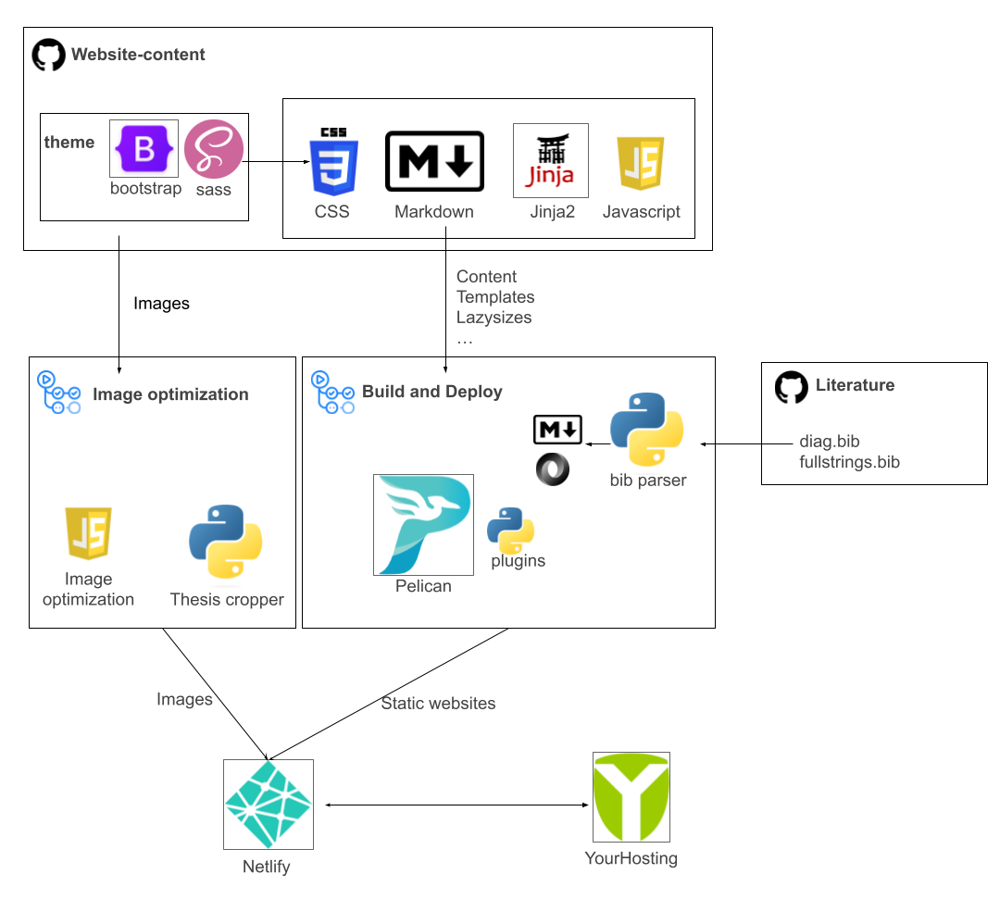

# UMCG - Anesthesiology overview of all current projects

This repository stores all the content and source code for the website of the department of Anesthesiology at UMCG. From this repository multiple Pelican-powered websites are built, based on a central content database.

## Websites

Live websites:

- Cluster: https://www.xxx.nl

Live subsites:

- Anesthesiology: https://xxx.nl
- Emergency Medicine: https://xxx.nl
- Intensive Care: https://xxx.nl

## Updating the content

Please see the [documentation](https://github.com/RobTolboom/umcg-anesthesie/tree/master/docs) for guides on updating the sites.

## Design resources

If you design an image/poster or similar for the website, please store the
design files (if not too big) in the directoy `content/src/` in the apropriate
subtree. This allows others to update media more easily should they ever become
outdated.

## Pipeline

